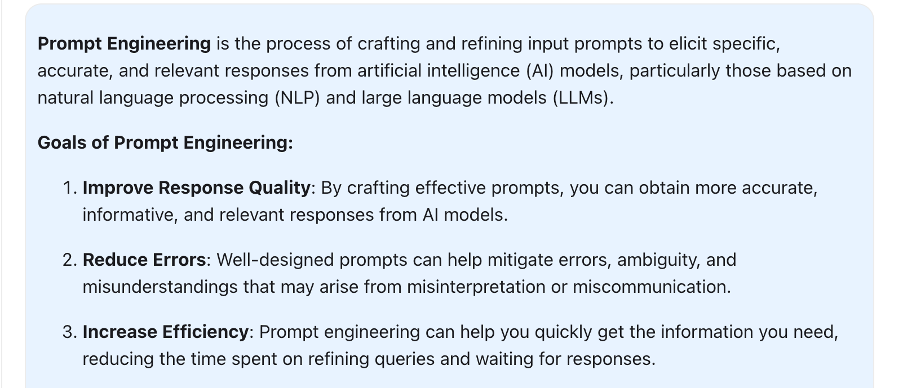

# Running Llama on Rackspace Cloud

In one of my favourite movie series The Avengers, Tony Stark (Iron Man) creates this Artificial Intelligence (AI) named Jarvis,
which helps him make much of his other works possible. This portrayal sparks curiosity: Are such sophisticated AIs possible in real life? Until a few years ago, AI capabilities like JARVIS were confined to the realm of science fiction. However, advancements in AI have bridged the gap between fantasy and reality, making powerful, customizable AI models accessible to enthusiasts and professionals alike.

<!-- more -->

<figure markdown="span">
    { width="700" height="300"}
    <figcaption>Llama running in the clouds</figcaption>
</figure>

We are obviously not at Jarvis level AI, but for most of us who are not Iron Man smart, being able to run a private AI, a chatbot, to validate
ideas, to write boilerplate code, to validate some python or go logic, and in my case to create unlimited princess bedtime stories for my little
ones is already something awesome. And today Rackspace provides all the building blocks to run our own AI.

## So how do I get it going on Rackspace Infrastructure ?

There are a few key things you will need:

- [x] Infrastructure that can provide GPU. Privided by Rackspace Spot. 
- [x] Large Language Model (LLM) to run. Provided by Meta Llama.
- [x] A framework to run your LLM. In our case its llama-stack
- [x] Chat UI and framework.

**[Meta Llama:](https://www.llama.com/)** is an open-source large language model developed by Meta AI, designed for various natural language processing tasks. It offers high performance and flexibility, making it suitable for both research and production environments.

**[llama-stack:](https://github.com/meta-llama/llama-stack)** is a framework that simplifies the deployment and management of Meta Llama models. It provides tools and utilities for running the model efficiently on different infrastructures, including cloud services like Rackspace.

**[Rackspace Spot:](https://spot.rackspace.com/)** is one of a kind real time Cloud Infrastucture auctioning market place by Rackspace.

## Lets take a look at the infrastructure first

The infrastructure that provides the computing capacity to run AI is very important.
You might have heard of all the major AI provides and the number of GPU they run to be albe to provide things like ChatGPT or Gemini etc. But
if you dont want to use a provider, becasue you want your chat to work on sensitive data, you need to run your own GPU. Rackspace is providing
GPU capable spot instances just for this. Lets take a look at how that work from a high level.

``` mermaid
flowchart LR
    id1[Request GPU VM] o-.-o id2{{SPOT builds AO Flavor}} o-.-o id3{{OpenStack PCI Passthrough to VM}} o-.-o id4[You get VM with GPU]
```

!!! note
    See what GPU flavors are available at **Rackspace Spot** [Here](https://spot.rackspace.com/docs/cloud-servers#gpu-servers)

We are not going to deep dive into how OpenStack is setup to provide a GPU to your virtual machine. If you are interested please
go to our flex documentation [here](https://docs.rackspacecloud.com/adding-new-node/#adding-the-node-in-openstack) for the details.

## Lets run a private Meta Llama3.1 on local GPU

We are looking to run a Llama3.1 based chat that provides the following basic capabilities:

**1. ChatGPT-like chat, reasoning, and text generation:**
Llama 3.1 can perform natural conversations similar to ChatGPT, generating human-like responses while engaging in complex reasoning. It helps users explore ideas, ask questions, and get meaningful, coherent answers in real time.

**2. Running agents for different functions:**
With Llama 3.1, you can deploy specialized agents for tasks like automation, data processing, or research assistance. These agents can operate independently, handling specific functions such as scheduling, data retrieval, or workflow automation.

**3. Uploading documents for chat-based interaction:**
Support the ability to upload documents, allowing users to ask questions and engage in conversations based on the document's content. This is powered by Retrieval-Augmented Generation (RAG), which combines the model's language understanding with real-time retrieval of relevant information from the document. RAG is crucial because it enhances the accuracy and relevance of the responses by grounding them in specific, up-to-date information from the uploaded data. This approach enables dynamic, context-aware conversations based on user-provided documents, making it highly useful for knowledge retrieval and research.

## Getting the instance ready for use

Before we can install the relavant components, lets ensure that our instance has the GPU and that we can use it.
First, verify the gpu is attached as a PCI device to the instance

```shell
   # lspci  | grep -i nvidia
     00:06.0 3D controller: NVIDIA Corporation GA103 (rev a1)
```
Here, we have Nvidia H100 GPU. Now, let install the required drivers to see it in action.

```shell
   # apt install ubuntu-drivers-common
   # ubuntu-drivers devices
     == /sys/devices/pci0000:00/0000:00:06.0 ==
     modalias : pci:v000010DEd00002321sv000010DEsd00001839bc03sc02i00
     vendor   : NVIDIA Corporation
     model    : GA103
     driver   : nvidia-driver-535-open - distro non-free
     driver   : nvidia-driver-535-server-open - distro non-free
     driver   : nvidia-driver-535 - distro non-free
     driver   : nvidia-driver-535-server - distro non-free
     driver   : nvidia-driver-550 - distro non-free recommended
     driver   : nvidia-driver-545-open - distro non-free
     driver   : xserver-xorg-video-nouveau - distro free builtin
```
Since nvidia-driver-550 is recommended, lets install that.

```shell
   # apt install nvidia-driver-550
```

Once the driver is installed, verify that nvidia-smi is working

```shell title="nvidia-smi"
   +-----------------------------------------------------------------------------------------+
   | NVIDIA-SMI 550.107.02             Driver Version: 550.107.02     CUDA Version: 12.4     |
   |-----------------------------------------+------------------------+----------------------+
   | GPU  Name                 Persistence-M | Bus-Id          Disp.A | Volatile Uncorr. ECC |
   | Fan  Temp   Perf          Pwr:Usage/Cap |           Memory-Usage | GPU-Util  Compute M. |
   |                                         |                        |               MIG M. |
   |=========================================+========================+======================|
   |   0  NVIDIA H100 NVL                Off |   00000000:00:06.0 Off |                    0 |
   | N/A   33C    P0             88W /  400W |   25587MiB /  95830MiB |      0%      Default |
   |                                         |                        |             Disabled |
   +-----------------------------------------+------------------------+----------------------+
```

Everything looks good and we are ready to install Meta Llama and its components.

## Installing Meta Llama3.1 and llama-stack

First thing we do is install Conda

```shell
   # wget https://repo.anaconda.com/miniconda/Miniconda3-latest-Linux-x86_64.sh
   # chmod 755 Miniconda3-latest-Linux-x86_64.sh
   # ./Miniconda3-latest-Linux-x86_64.sh
   # conda create -n stack python=3.10
   # conda init
   # conda activate stack
```

Install llama-stack and llama-client
```shell
   pip install llama-stack>=0.0.40
   pip install llama-stack-client
```

Then, download the meta Llamd3.1-8B-Instruct model
```shell
   llama download --source meta --model-id Llama3.1-8B-Instruct --meta-url META_URL
```

META_URL here is something you will receive in email from meta once you sign up at https://www.llama.com/llama-downloads
Git clone the app stack provided by meta. This repo has all the examples you will need to get your first model running.

```shell
   git clone https://github.com/meta-llama/llama-stack-apps.git
   cd llama-stack-apps
   pip install -r requirements.txt
   llama stack build
   llama stack configure <name from previous step>
   llama stack run <name from previous step> 
```

!!! tip
    Make sure you do the `llama stack run <name>` on a differnt session.

With the llama stack running the model, you can start the chat UI provided by llama-stack.

```shell
   PYTHONPATH=. mesop app/main.py
```

Assuming everythign went well with installation, you can view your UI, which might look similar to:

<figure markdown="span">
    { width="700" height="300"}
    <figcaption>Your very own private llama3.1 chat</figcaption>
</figure>

## Prompt Engineering: A Quick Intro

```shell title="Prompt Engineering"
   Q. What is Prompt Engineering?
```

<figure markdown="span">
    { width="700" height="300"}
</figure>

Prompt Engineering is the process of crafting and refining input prompts to elicit specific, accurate, and relevant responses from artificial intelligence (AI) models, particularly those based on natural language processing (NLP) and large language models (LLMs).

- **Key Concepts in Prompt Engineering:**

	* Prompt Design: Crafting clear, concise, and unambiguous input prompts that accurately convey the user's intent.
	* Prompt Refining: Iteratively refining the prompt to improve the response quality, accuracy, and relevance.
	* Prompt Adapting: Adjusting the prompt to accommodate different AI models, language styles, and cultural nuances.
	* Prompt Optimization: Using machine learning and optimization techniques to fine-tune the prompt and improve its effectiveness.

- **Best Practices for Prompt Engineering:**

	* Be Specific: Clearly define the task, question, or request in the prompt.
	* Use Natural Language: Write the prompt in a natural, conversational style.
	* Avoid Ambiguity: Minimize ambiguity and ensure the prompt is unambiguous.
	* Test and Refine: Continuously test and refine the prompt to improve its effectiveness.

- **Applications of Prompt Engineering:**

	* Chatbots and Virtual Assistants: Crafting effective prompts for conversational interfaces.
	* Language Translation: Developing prompts for machine translation systems.
	* Content Generation: Refining prompts for AI-powered content creation.
	* Text Summarization: Crafting prompts for summarization systems.

By mastering the art of prompt engineering, you can unlock the full potential of AI models and obtain more accurate, relevant, and helpful responses to your queries.


Ther follwing might help a new prompt engineer to get started:

[www.promptingguide.ai](https://www.promptingguide.ai/introduction/tips)

[Llama Prompt Docs](https://www.llama.com/docs/model-cards-and-prompt-formats/llama3_1/)

## Get Started Today!

Running Meta Llama on Rackspace Cloud empowers you to harness the capabilities of advanced AI without relying on third-party providers. By setting up your own infrastructure, you gain greater control over your data and the flexibility to customize the AI to your specific needs. Whether you're developing chatbots, automating tasks, or generating creative content, running AI locally opens up a world of possibilities. With Rackspace's GPU-optimized instances and the robust llama-stack framework, deploying your private AI has never been more accessible. Ready to deploy your own AI model? Follow the steps outlined above to set up Meta Llama on Rackspace Cloud and explore the endless possibilities of private AI. 

If you are looking for professional AI engineering help take a look at:

[Rackspace AI Anywhere Private Cloud Solutions](https://www.rackspace.com/cloud/private/ai-anywhere)

[Rackspace AI an ML solutions](https://www.rackspace.com/data/ai-machine-learning)

