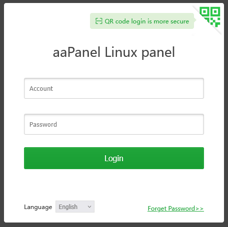
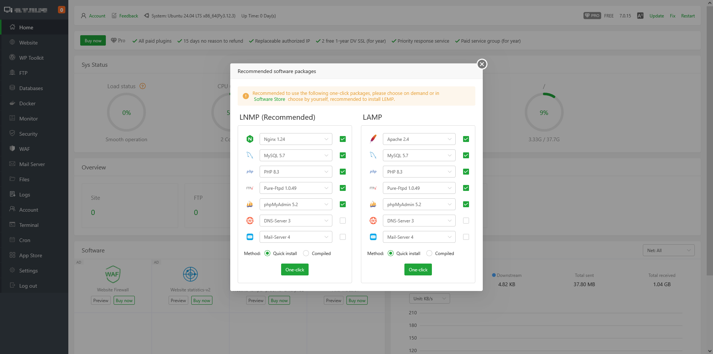

# Installing aaPanel on a Flex Instance
This documentation provides a comprehensive guide to installing the free version of **aaPanel** on an **Ubuntu 24** instance running on **Rackspace Flex Cloud**. aaPanel is a lightweight, user-friendly control panel that simplifies server and website management by offering a graphical interface for handling web services, databases, and security configurations. There is also a paid version of aaPanel which you can purchase through them and install.

<!-- more -->

#### Target Audience
This guide is intended for **system administrators, developers, and cloud engineers** who need a straightforward method to deploy and manage web services on an OpenStack-based Ubuntu 24 instance. A basic understanding of Linux, networking, and OpenStack is recommended but not required.

#### Prerequisites
Before proceeding, ensure you have:

- **Ubuntu 24** instance deployed on Rackspace Flex Cloud
- **Floating IP** assigned to the instance
- **SSH access** to the instance
- **sudo privileges** on the server
- **Security Group rules** allowing traffic on necessary ports (15758|888|80|443|20|21)

If you're unsure of how to set this up, see our Getting Started guide here: https://docs.rackspace.com/docs/accessing-rackspace-flex-cloud

By the end of this guide, you will have a fully functional **aaPanel installation** on your OpenStack-based Ubuntu 24 instance, ready for web hosting and server management.

## Step 1: Switch to Root User
Run the following command to switch to the root user:

``` shell
sudo su -
```

## Step 2: Download and Install aaPanel
Use the following command to download and install aaPanel:

``` shell
URL=https://www.aapanel.com/script/install_7.0_en.sh && if [ -f /usr/bin/curl ];then curl -ksSO "$URL" ;else wget --no-check-certificate -O install_7.0_en.sh "$URL";fi;bash install_7.0_en.sh aapanel
```
You will be prompted to answer some Y/N questions

After installation, aaPanel will display:

``` shell
==================================================================
Congratulations! Installed successfully!
==================================================================
aaPanel Internet Address: https://12.34.567.240:12345/5ca07b9c
aaPanel Internal Address: https://19.150.0.223:12345/5ca07b9c
username: rsad2ji
password: dcfdas6
Warning:
If you cannot access the panel,
release the following port (19148|888|80|443|20|21) in the security group
==================================================================
Time consumed: 1 Minute!
```

Save these credentials securely as you'll be able to access the panel using these URLs and credentials.

## Step 3: Install Certbot for SSL
Install Certbot, which will be used to generate an SSL certificate:

``` shell
sudo apt install -y certbot
```

## Step 4: Obtain a Let's Encrypt SSL Certificate
Run the following command, replacing aapanel.mydomain.com with your actual domain:

``` shell
sudo certbot certonly --standalone -d aapanel.mydomain.com
```
You'll be prompted for...

- An email address to contact regarding the cert's expiration
- Acceptance of Terms
- Approve/Deny account registration

This command will generate SSL certificates and store them in /etc/letsencrypt/live/aapanel.mydomain.com/.

## Step 5: Apply SSL Certificate to aaPanel
Copy the newly issued SSL certificate to aaPanel’s SSL directory:

``` shell
sudo cp /etc/letsencrypt/live/aapanel.mydomain.com/fullchain.pem /www/server/panel/ssl/certificate.pem
```

Copy the private key as well:

``` shell
sudo cp /etc/letsencrypt/live/aapanel.mydomain.com/privkey.pem /www/server/panel/ssl/privateKey.pem
```

## Step 6: Restart aaPanel
To apply the SSL changes, restart aaPanel:

``` shell
bt restart
```

## Step 7: Verify SSL Installation
Open your browser and navigate to the Internet URL provided in the output of Step 2.

You should now be able to reach the login page successfully over HTTPS with the valid Let's Encrypt SSL certificate.

<figure markdown="span">
  { width="456" height="455"}
</figure>

<figure markdown="span">
  { width="905" height="455"}
</figure>

## Conclusion
You have successfully installed aaPanel on an Ubuntu 24 OpenStack instance and secured it with SSL encryption. Your panel is now accessible via HTTPS with a valid certificate.

###  (Optional but Recommended): Automate SSL Renewal
Let's Encrypt certificates expire every 90 days, so it's best to set up automatic renewal.

Edit the crontab:

``` shell
sudo crontab -e
```
You'll be prompted to choose the Linux text editor of choice to edit the crontab.

After making your selection add the following line to check for renewal daily at 3 AM:

``` shell
0 3 * * * certbot renew --quiet && cp /etc/letsencrypt/live/aapanel.mydomain.com/fullchain.pem /www/server/panel/ssl/certificate.pem && cp /etc/letsencrypt/live/aapanel.mydomain.com/privkey.pem /www/server/panel/ssl/privateKey.pem && bt restart
```

Save and exit. Now your certificate will automatically renew for you.


