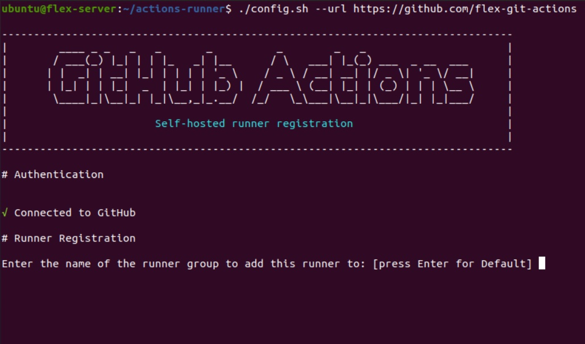

# Installing Github actions on a Openstack-Flex Instance

## Introduction

Welcome! In this blog post we are going to go over connecting our Openstack-Flex instance to GitHub-actions through the use of self-hosted runners. We will be using an small Ubuntu image for our example, but if you would like a more in-depth look into setting up your environment please check out James’ blog post [here](https://blog.rackspacecloud.com/blog/2024/06/18/getting_started_with_rackspace_openstack_flex).

## Creating our Openstack-Flex Server

Fist we are going to create our Flex router. 

``` shell
openstack  --os-cloud {cloud_name} router create flex-router
```

Second we are we wil create our flex network

``` shell
openstack  --os-cloud {cloud_name} network create flex-network
```

Next we are going to set our router's external gateway to PUBLICNET to grant access to the internet.

``` shell
openstack  --os-cloud {cloud_name} router set --external-gateway PUBLICNET flex-router
```

Now we are going to set up our subnet, you can choose between ipv4 and ipv6. The ip range is also up to you. For the DNS name server you will need to ping cachens1.sjc3.rackspace.com and cachens2.sjc3.rackspace.com.

``` shell
ping cachens1.sjc3.rackspace.com -c2
ping cachens2.sjc3.rackspace.com -c2

openstack  --os-cloud {cloud_name} subnet create --ip-version 4 --subnet-range 172.18.107.0/24 --dns-nameserver 216.109.154.188 --dns-nameserver 216.109.154.189 --network flex-network flex-subnet
```

Connect the subnet to our flex-router

``` shell
openstack --os-cloud {cloud_name} router add subnet flex-router flex-subnet
```

Now we need to create our security group, this is the group which specify the network access rules. For our example now we are only going to allow SSH access. 

``` shell
openstack --os-cloud {cloud_name} security group create flex-sg
```

``` shell
openstack --os-cloud {cloud_name} security group rule create --ingress --remote-ip 0.0.0.0/0 --dst-port 22 --protocol tcp flex-sg
```

Now we need to create our floating ip. 

!!! note

    Save this ip for later we will need to connect it to our server.

``` shell
openstack --os-cloud {cloud_name} floating ip create --subnet PUBLICNET_SUBNET PUBLICNET
```

Now we are going to create our Public and Private ssh keys so we can securely connect to our server. I am naming my key wordpress-key

``` shell
ssh-keygen
```
This will prompt you store and name your private key. I did something like this /home/{username}/.ssh/flex-key. 

After that we will create our public key using the command below then we will assign it using the the openstack cli tools.

``` shell
ssh-keygen -f ~/.ssh/flex-key -y > ~/.ssh/flex-key.pub 
openstack —os-cloud {cloud_name} keypair create --public-key ~/.ssh/flex-key.pub flex-key
```

Now we create our server! This should include the flavor you'd like to use, the image, memory, network, key-name, and security group for this example. 

``` shell
 openstack --os-cloud {cloud_name} server create --flavor m1.medium --image Ubuntu-22.04 --boot-from-volume 40 --network flex-network --key-name flex-key --security-group flex-sg flex-server
```

Assigning our floating ip. We can do this by adding it to our port for the server. If you get the fixed ip from our newly create server you can find the port ID by searching through the port list.

``` shell
openstack --os-cloud {cloud_name} port list
openstack --os-cloud {cloud_name} floating ip set --port {port id} {floating-ip}
```

SSH into your new Server! 

``` shell
ssh -i ~/.ssh/flex-key ubuntu@{floating-ip}
```

##Getting started with Github-Actions and Runners

For this example I created a github organization called Flex-git-actions, once you have your organization set-up you will need to go to settings and find the drop down menu “actions”  and click “runners”. Once you have done that you should be looking at window like this. 


Now I am using Linux for my server so that is the option I chose. 

First thing we are going to do is create our actions-runner directory

``` shell
mkdir actions-runner && cd actions-runner
```

Then we are going to download the latest runner package, this can be found on GitHub under your organization as seen in the screenshot earlier. This example is just for convenience.

``` shell
curl -o actions-runner-linux-x64-2.317.0.tar.gz -L https://github.com/actions/runner/releases/download/v2.317.0/actions-runner-linux-x64-2.317.0.tar.gz
```

``` shell
tar xzf ./actions-runner-linux-x64-2.317.0.tar.gz
```

Create the runner and start the configuration experience

``` shell
./config.sh --url https://github.com/flex-git-actions --token ALTQQFVZPJW3L2WHXVR2RYTGSWHD6
```

This last command should bring you to this screen. 



Congratulations, you have installed github actions on your Openstack-Flex server!
